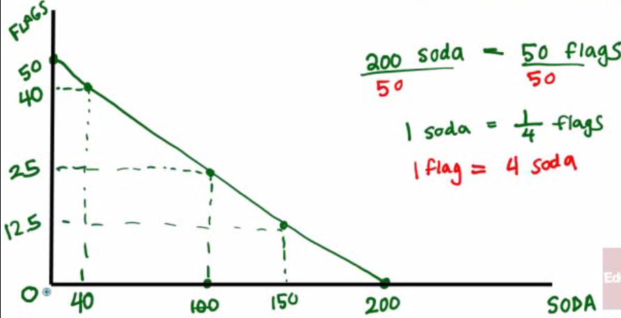

# Production Possibilities Frontier

  -  **Graph** that shows the combinations of amounts of **two items**
     that could be produced using the **same resources**

  -  All points on the graph are points of **efficiency**

  -  If you don't use all resources, then you have points of
     **underutilization** ( or **inefficiency**)

  -  PPF Graph show alternative ways to use resources but does not show
     the **best** way because that is a **normative issue**.

  -  Famous "Guns or Butter" Analogy
    
      -  Government could use its resources to produce "guns" or
         military goods.
    
      -  Government could use its resources to produce "butter" or
         domestic goods.
    
      -  It highlights the **trade-offs** an economy faces in using
         **scare resources**.

  
  
  ![are plotted with gun production measured on the vertical axis and
  butter produc- tion along the horizontal axiso 25 20 15 10 5 5 20 25
  30 15 35 BUTTER 40 Fig. 201 Production Possibilities Frontier The
  economy has the option of producing any combination of guns and butter
  along the frontier, At Point B most of the economy's resources are
  devoted to butter production, Only three guns are produced, At Point F
  gun production is predomi- nante Still, the economy is using its
  resources fully and efficiently at both pointso A normative analysis
  is required to determine which point is preferredo On efficiency
  grounds all the points along the frontier are equal, Points inside the
  frontier (Point I) are possible alsoa However, if the economy is
  operating at a point inside the frontier, resources are not being used
  fully or effi- cientlye Consider Point I, where 10 pounds of butter
  and six guns are being pro- duced per yeare By the definition of the
  production possibilities frontier we know that when the economy
  produces 10 pounds of butter, 12 guns could be produced if resources
  were used fully and efficiently (Point E). Point I represents a
  combina- tion of guns and butter that does not require full or
  efficient resource utilization, The economy could do better by
  producing some combination of the two goods that lies on the frontier.
  Points outside the production possibilities frontier (Point J) are
  unobtainable. Point J represents a combination of 25 pounds of butter
  and nine guns per yearo By the def- inition of the production
  possibilities frontier we know that if 25 pounds of butter are
  produced, only three guns can be produced (Point B) if resources are
  used fully and efficiently Therefore, points outside the frontier
  cannot be attained at this time, ](./media-ch1/image6.png)
  
   

# Shift in the Production Porribilities Frontier

  -  Points outside the PPF may be attained at some future date because
     the frontier may shift so that points like J lie along the new
     frontier.

  -  The frontier can also shift **inward** representing a change for
     the **worse**.

  -  **Factors** that cause the PPF to shift:
    
      -  changes in the amount **resources** in the economy
    
      -  change in **technology** and **productivity**

#  

# Increasing Opportunity Cost

  -  **More and more** resources are required to produce the **same**
     amount of a product

  -  Curve for this type of PPF graph will be **concave**.

  
  
   

# Constant Opportunity Cost

  -  **Same** resources are required to produce a certain amount of a
     product

  -  Product Possibilities frontier will be a **downward-sloping
     line**.

 

# Opportunity cost and PPF graph

