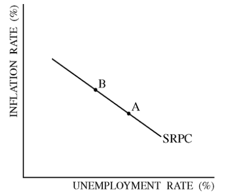
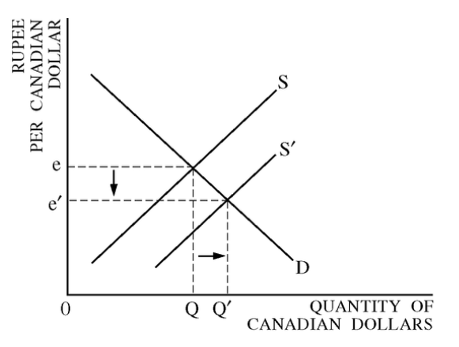

# Question 1 (b)

  -   **Decrease** in **taxes** raises **disposable income** and
      increases **consumption spending**

  -   The effect of decrease in taxes on the Phillips curve

  

# Question 1 (c)

  
  
  

# Question 2 (a)

  -   Total change in reserves = The change of government securities

# Question 2 (b)

  -   Money supply is vertical, since it is controlled by the federal
      bank

  

# Question 3 (a)

  
  
  

  -   The supply of Canadian dollars will increase, because Canadian
      investors will be attracted by the higher real interest rate in
      India and increase their purchase of Indian financial assets

  ![The demand for currency The demand for currencies is derived from
  the demand for a country's exports, and from speculators looking to
  make a profit on changes in currency values. The supply of currency
  The supply of a currency is determined by the domestic demand for
  imports from abroad. For example, when the UK imports cars from Japan
  it must pay in yen (Y), and to buy yen it must sell (supply) pounds.
  The more it imports the greater the supply of pounds onto the foreign
  exchange market. A large proportion of short-term trade in currencies
  is by dealers who work for financial institutions. The London foreign
  exchange market is the World's single largest international exchange
  market. ](./media/image209.png)

# Question 3 (b)

  
  
  