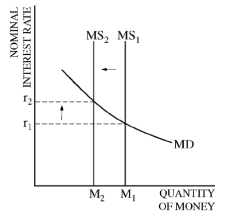

<a href="./exams/Free Response 2009.pdf"  target="_blank" >Free Response 2009</a>

<a href="./exams/Scoring Guidelines 2009.pdf"  target="_blank" >Scoring Guidelines 2009</a>

# Question 1 (d)

  -   Money Supply in the graph of the money market is vertical

  

# Question 1 (e)

  -   Higher interest rate decreases investment and interest-sensitive
      consumption spending, and that both consumption and investment are
      components of aggregate demand.

# Question 1 (f)

  

# Question 2 (b)

  ![26-3a Supply and Demand for Loanable Funds The economy's market for
  loanable funds, like other markets in the economy, is governed by
  supply and demand. To understand how the market for loanable funds
  operates, therefore, we first look at the sources of supply and demand
  in that market. The supply of loanable funds comes from people who
  have some extra income they want to save and lend out. This lending
  can occur directly, such as when a household buys a bond from a firm,
  or it can occur indirectly, such as when a household makes a deposit
  in a bank, which in turn uses the funds to make loans. In both cases,
  saving is the source of the supply of loanablefunds. The demand for
  loanable funds comes from households and firms who wish to borrow to
  make investments. This demand includes families taking out mortgages
  to buy new homes. It also includes firms borrowing to buy new
  equipment or build factories. In both cases, investment is the source
  of the demand for loanable funds. ](./media/image199.png)

# Question 3 (a)

  
  
  

  -   Maximum change in money supply = Initial deposit / RRR - Initial
      deposit

# Question 3 (c)

  -   Inflation will decrease the value of real wages.

  