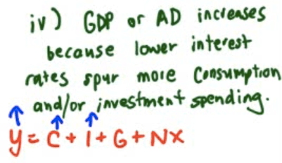
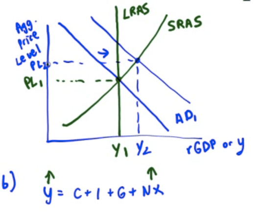
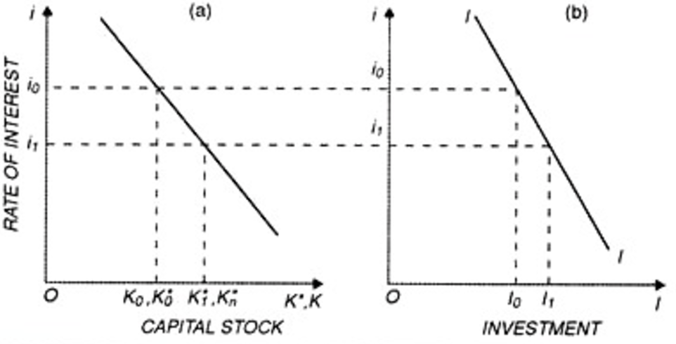

<a href="./exams/Free Response 2012.pdf"  target="_blank" >Free Response 2012</a>

# Question 1 (a)

  
  
  

# Question 1 (b)

  -   Label the x-axis as "Quantity of Money"

  -   Use MS, MD instead of S, D to represent money supply and money
      demand

  -   MD could be a straight line or a inside-curved line

  -   Label r1, r2 and M1, M2

  

  -   Real interest rate = nominal interest rate - inflation

  -   No change to the price level --\> inflation = 0

  

# Question 1 (c)

  -   Current Account
    
      -   Balance of payments on **goods** and **services** plus **net
          international transfer payments** and **factor income**
    
      -   **Sales and purchases of goods and services**
        
          -   Payments from foreigners: $2,000,000
        
          -   Payments to foreigners: $2,500,000
        
          -   Net: -$500,000
    
      -   **Factor Income**
        
          -   Payments from foreigners: $800,000
        
          -   Payments to foreigners: $600,000
        
          -   Net: $200,000
    
      -   **International Transfers**
        
          -   funds sent by residents of one country to residents of
              another
        
          -   Net: -$100,000
    
      -   **Current Account (CA) = Net foreign sales of goods and
          services + net factor income + net international transfer** =
          -500,000 + 200,000 - 100,000 = -400,000
    
      -   Current account deficit: CA \< 0
    
      -   Current account surplus: CA \> 0
    
      -   Another Example

  
  
   
  
  

# Question 2 (b)

  -   M1 = Currency + Checkable
  deposits

  

  -   Assets = Liabilities

  -   Withdrawal will change the required reserves, thus changing the
      excess reserves

  

# Question 2 (c)

  -   Bank can borrow from the **Federal Reserve** or from **another
      bank** if it runs out of money

# Question 3 (a)

  -   x-axis: Real GDP or Y

  -   y-axis: (Aggregated)Price Level

  

# Question 3 (b)

  -   Increase in exports will shift the AD to the right

  

# Question 3 (c)

  

# Question 3 (d)

  
  
  
  
  
  
  