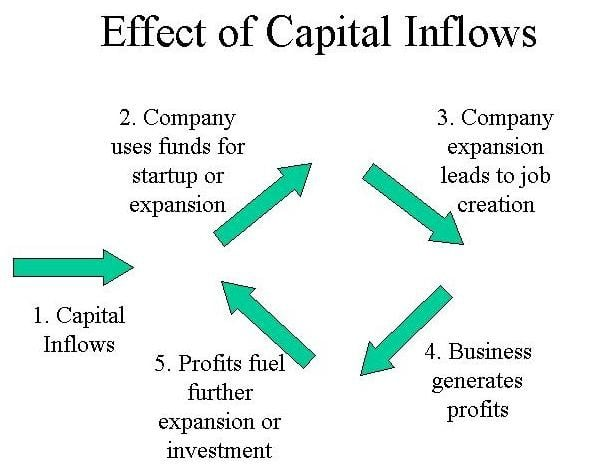
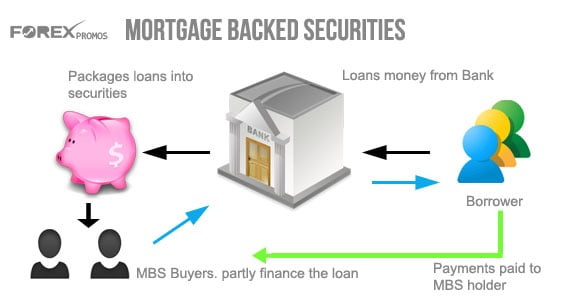
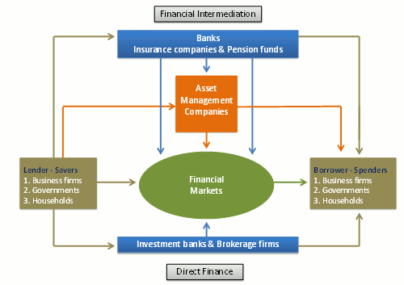

# Saving-Investment Spending Identity

  -   Saving-investment spending identity
    
      -   Fact of accounting is that they are always **equal** for the
          economy **as a whole**

  -   Imagine a country with **no government** and **no trade**
    
      -   Y = C + I
    
      -   Total Income = Total Spending
    
      -   Total Income = Consumer spending + Savings
    
      -   Total spending = Consumer spending + investment spending
    
      -   Therefore **Savings = Investment spending**

# Budget Surplus and Deficit

  -   Sometimes, the government will "**save**" money and in other
      years, it will **spend more** than its revenue collected in taxes

  -   Budget **surplus**
    
      -   occurs when government **revenue exceeds** government
          **spending**

  -   Budget **deficit**
    
      -   occurs when government **spending exceeds** government
          **revenue**

  -   Budget **balance**
    
      -   **difference** between government spending and revenue (either
          deficit or surplus)

  -   National savings
    
      -   **private savings + budget balance**

# Capital Inflows and Outflows

  -   Countries receive **inflows** of funds and also generate
      **outflows** of funds

  -   Capital inflow
    
      -   **net inflow** of funds into the
  country

  

  -   In 2008, the United States had capital inflows totaling $707
      billion, meaning the US is an attractive place to save money
    
      -   Total investment spending = $ 2,632 billion
    
      -   Private savings = $2,506.9 billion
    
      -   Budget deficit = $683 billion
    
      -   Capital inflows = $707 billion
    
      -   National Savings = Private Saving - Budget Deficit
    
      -   National Savings + Capital Inflow = $2,530.9
    
      -   Statistical discrepancy = Investment - Savings = $101.1
          billion

# Tasks of a Financial System

  -   Reduce Transaction Costs
    
      -   Companies will **get loans** from banks or **issue bonds** to
          **raise money **
    
      -   To get a comparable amount form **individuals** would be
          logistically **difficult** if not impossible

  -   Reduce Risk
    
      -   People have various levels of **risk tolerance**, so financial
          systems **reduce risk** through **diversification **
    
      -   **Sole ownership** of a $1 billion company would be **risky**

  -   Provide Liquidity
    
      -   Having access to **cash** is critical
    
      -   **Liquid assets** are generally preferred to **illiquid
          assets**

# Types of Financial Assets

  

  -   Bonds
    
      -   An IOU issued by the borrower with the seller of the bond
          paying a **fixed** yearly **interest** and **principal** at
          the **end of the term** of the loan
    
      -   The **higher** the default **risk**, the **higher** the
          interest **rate**

  -   Loan-backed securities
    
      -   Loans that are **packaged together** & **sold** as **assets**
    
      -   Financial crisis of 2008, in part, because high rate of
          mortgage-backed securities defaulted

  -   Stocks
    
      -   **Direct ownership** in a company
    
      -   Owning one share of Apple (AAPL) means you own 1/900,000,000
          of the
  company

# Financial Intermediary

  

  -   Institutions that **transforms funds** gathered from **many
      individuals** into **financial assets**
    
      -   Mutual Funds
    
      -   Pension Funds
    
      -   Life Insurance Companies
    
      -   Banks

  -   About 75% of wealth in the United States is held through these
      four types of financial intermediaries rather than directly
      through cash

  -   Mutual Funds
    
      -   Financial intermediary that creates a **portfolio of stocks**
          and/or bonds and then sells **shares** to **individual
          investors**
    
      -   Major benefit includes **diversification** of investments
          rather than owing one single stock
    
      -   Major downside would be the **inability** to hit a
          "**homerun**" with one single stock
    
      -   In the United States, households own over $10 trillion in
          mutual funds
    
      -   Fidelity Investments (2013) had ~$1.8 trillion in assets under
          management

  -   Pension Funds
    
      -   Pension funds are **mutual funds** that hold assets for its
          members to provide **retirement income**
    
      -   Two of the largest pension funds in the United States are
          CalSTRS and CalPERS
    
      -   California teachers opt out of Social Security (6.2%) and pay
          into CalSTRS (8%)

  -   Life Insurance Companies
    
      -   Life insurance companies take in **premiums** from
          **policyholders** and make payments to **beneficiaries** upon
          **death** of insured
    
      -   Term, ROP Term, Universal, Whole
    
      -   Life insurance companies pool together individual premiums,
          make various **investments** and do their best to **avoid
          making payouts **

  -   Banks
    
      -   Banks **accept funds** from **depositors**
    
      -   Banks keep only **a fraction** of a customers' deposits in the
          form of **cash**
        
          -   Most deposits **are lent** out to businesses, home buyer
              and other borrowers
        
          -   Banks lends for **long period** of times but subject to
              the condition that its **depositors could demand funds**
              at any time
    
      -   The Federal Deposit Insurance Corporation (FDIC) insures up to
          $250,000 for each account

# Practice Questions

  -   Reducing which of the following is a task of the financial system
    
    a.   Transaction costs
    
    b.   Risk
    
    c.   Liquidity

  Answer: a & b

  -   Which of the following is NOT a type of financial asset
    
    a.   Loan-Backed Securities
    
    b.   Bonds
    
    c.   Bank Deposits
    
    d.   Stocks
    
    e.   Car

  Answer: e

  -   The federal government is considered to be "saving" money when
    
    a.   There is a budget deficit
    
    b.   There is a budget surplus
    
    c.   There is no budget surplus or deficit
    
    d.   Saving does not equal investment spending
    
    e.   National savings equals private savings

  Answer: b

  -   A nonprofit institution collects the saving of its members and
      invest those funds in a variety of assets so that it can provide
      retirement income to its members is called which of the following?
    
    a.   Mutual Fund
    
    b.   Life Insurance Company
    
    c.   Pension Fund
    
    d.   Credit Union
    
    e.   Bank

  Answer: c