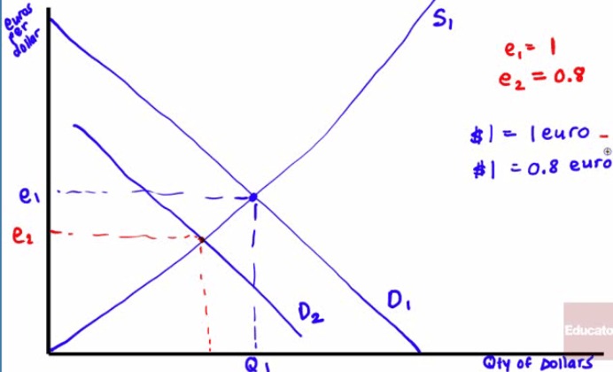
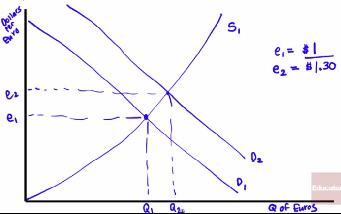
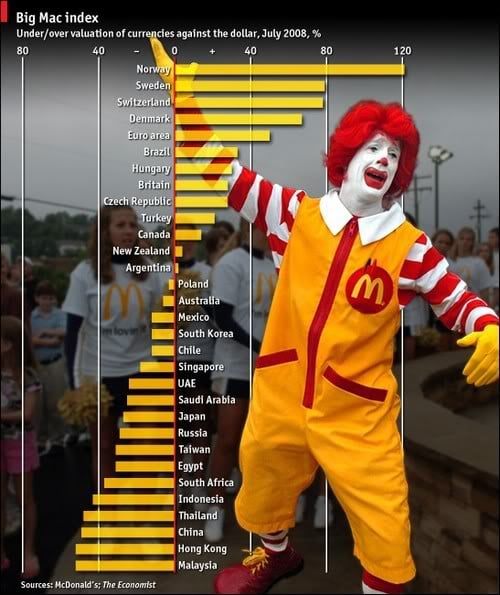
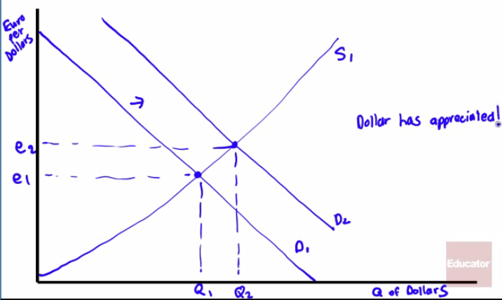
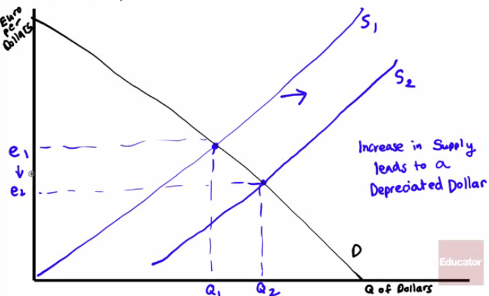

# Understanding Exchange Rates

  -   In general, **stuff produced** in a country will be paid for that
      **country's currency**
    
      -   US pruducts will be paid in dollars
    
      -   Japanese products will be paid in yen
    
      -   European products will be paid in euros
    
      -   British products will be paid in pounds

  -   Foreign exchange markets
    
      -   **market** in which **currencies** are **exchanged** for each
          other in which exchange rates are determined

# The Foreign Exchange Market

  -   When the Euro was first introduced, 1 Dollar = ~1 Euro. What has
      happened since?

  -   Show using quantity of US Dollars on the x-axis, and euros per
      dollar on the y-axis
    
      -   Dollar has **depreciated**
    
      -   **Bad** for **US travelers** to Europe
    
      -   **Good** for **US business**

  

  -   When the Euro was first introduced, 1 Euro = ~1 Dollar. What has
      happened since? Show using quantity of Euros on the x-axis, and
      Dollars per Euro on the y-axis
    
      -   Euro has **appreciated**
    
      -   **Europeans travelers** to the US can **purchase more** stuff
    
      -   **European business** now will **export less**, because their
          products are **more expensive**, relative to US
  business

  

# Inflation and Real Exchange Rates

  -   In 1990, 1 US Dollar = 2.8 Mexican Pesos

  -   In 2010, 1 US Dollar = 12.8 Mexican Pesos

  -   Why?

  -   Inflation in Mexico was much higher than US inflation

  -   **Real exchange rates** take into account the **impact of
      inflation** in both countries

  -   

  -   The **current account** responds only to changes in the **real
      exchange**, not the nominal exchange rate\!

  -   It still makes sense, however, to **hold** onto the **currency
      with lesser inflation**

  

# Purchasing Power Parity (PPP)

  -   Useful tool for **analyzing interest rates** is a concept known as
      **purchasing power parity**

  -   The purchasing power parity or PPP between two countries'
      currencies is the **nominal exchange rate** at which a given
      **baskets of goods and services** would cost the **same amount in
      each country**

  -   In theory, you "should" be able to buy $100 worth of stuff in any
      country

  -   For example, if 1 pound = 2 dollar, then $100 in the US should buy
      the same amount of stuff that 50 pounds would get you in the UK

  -   Over the **long run**, purchasing power parities do a good job of
      **predicating** the **nominal exchange rates**

# Burgernomics

  -   The Big Mac index was first published in 1986 as an example of
      PPP, using the **Big Mac** as the **benchmark**

  -   **Not** the **best measure**, as Argentina is not included because
      it did not want to be part of the 100+ countries on the list

  -   In India, the $1.54 Big Mac is a Big Mac made of chicken, so is it
      really a Big Mac?

  -   In 2014, a Big Mac in the US sells for $4.62 which is remarkably
      close to what it costs in the United Kingdom at $4.63

  -   Overvalued Big Macs: Norway, Sweden, Denmark, Brazil, Switzerland

  -   Undervalued Big Macs: Chinese yuan, Russia ruble, South African
      rand, Mexican peso, Indian
  rupee

  

# Floating vs. Fixed Exchange Rate Regime

  -   Fixed exchange rate
    
      -   When the government keeps the exchange rate **against** some
          other currency at or near a **particular target**
    
      -   Hong Kong sets an exchange rate of 7.80 HK Dollars to 1 US
          Dollars
    
      -   Through **manipulation of supply** and **demand**, countries
          can
    
      -   If the equilibrium is **lower** than the target rate, the
          government will **buy** currency to prop it up
    
      -   If the equilibrium is **higher** than the target rate, the
          government will **sell** the currency to keep it from rising

  -   Floating exchange rate
    
      -   The exchange rate **goes** where the **market takes** it (ie.
          United States, UK, Canada)

# Exchange Rate Dilemma

  -   Fixed rate regimes give **predictability** to **trade partners**
      as business with the United States operates as such, as do
      **European countries** adopting the **Euro** (ie. Italy, France,
      Germany)

  -   Every choice has a cost\!
    
      -   Countries keep large quantities of foreign currency on hand
          **at low return**
    
      -   **Monetary policy** is diverted to maintaining exchange rates
    
      -   You **give up** use of **monetary policy** (as European
          countries did in adopting the Euro)

# Practice Questions

  -   On a Foreign Exchange Market Graph, what happens if capital flows
      from Europe to the United States has increased? Has the dollar
      appreciated or
  depreciated?

  

  -   On a Foreign Exchange Market Graph, what would happen if there was
      an increase in US demand for imports from Europe? Has the dollar
      appreciated or depreciated?

  

  -   Which of the following is a benefit of a fixed exchange rate
      regime?
    
    1.   Certainty about the value of domestic currency
    
    2.   Commitment to inflationary policies
    
    3.   No need for foreign exchange reserves
    
    4.   Allows unrestricted use of monetary policy
    
    5.   All of the above

  Answer: a